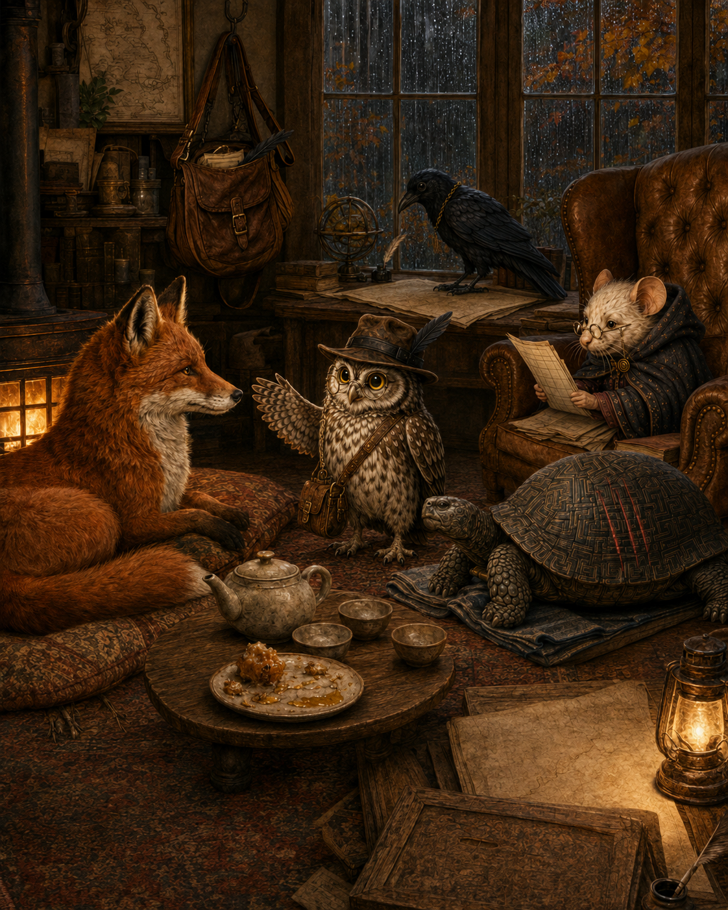
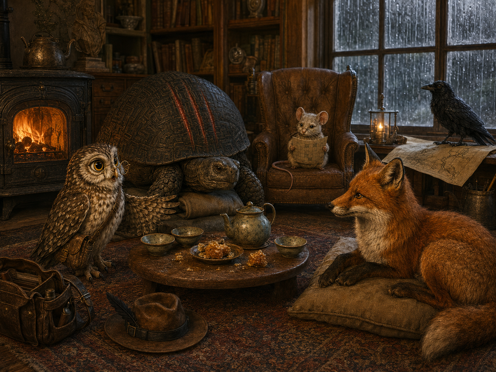

# Praxisfall: Wenn ein lokaler Bildfix zum unbeabsichtigten Neubau wird

Dieses Praxisbeispiel dokumentiert einen kleinen realen Fehlerfall aus der Bildentwicklung der Kinderbuchreihe „Indiana Hood“.

Es ist **kein Benchmark, kein kontrollierter With-vs-Without-Skill-Versuch und kein allgemeiner Wirksamkeitsnachweis**. Der Fall zeigt lediglich eine konkrete Praxisbeobachtung: Ein kleiner Änderungsauftrag entgleiste ohne den vorgesehenen Bildarbeits-Workflow zu einem weitreichenden Neubau. Nach der bewussten Rückkehr zu den relevanten Bild-Skills wurde der Arbeitsauftrag wieder enger über Szenenmoment, Entitäten, Größenrelationen und Kontinuität geführt.

## Kurzfassung

Der Ausgangspunkt war bereits weitgehend brauchbar. Nur die Größenwirkung von Sokrates war zu schwach.

Der gewünschte Eingriff lautete sinngemäß:

> Sokrates etwas größer und massiver darstellen, die restliche Komposition möglichst unangetastet lassen.

Der anschließende vermeintlich „ultra-lokale“ Korrekturversuch veränderte jedoch weit mehr als die Schildkröte: Kamerawirkung, Figurenanordnung, Requisiten, Raumgewichtung und erzählerischer Fokus drifteten mit.

Erst danach wurde der Bildarbeits-Workflow wieder bewusst aktiviert und mit den passenden Skills neu aufgesetzt.

```text
weitgehend funktionierendes Ausgangsbild
→ kleiner lokaler Änderungswunsch
→ Korrektur ohne ausreichend harten Workflow-Rahmen
→ unbeabsichtigter kompositorischer Neubau
→ Fehleranalyse
→ Bild-Skills wieder aktivieren
→ Szenenmoment, Entitäten, Größenrelationen und Kontinuität neu festlegen
→ kontrollierter Neustart
```

## 1. Ausgangsbild: ein lokales Problem

Die erste Fassung erfüllte viele Anforderungen bereits gut:

- ruhiger Museums-/Regenmoment;
- erkennbare Gesprächsachse;
- wiederkehrende Figuren im gemeinsamen Raum;
- Reise-Nachklang und Arbeitsatmosphäre;
- funktionierende Grundkomposition.

Der relevante Fehler war vergleichsweise klein: **Sokrates wirkte im Verhältnis zu den anderen Figuren zu klein und zu wenig massiv.**



Die richtige Änderungsstrategie wäre deshalb ein enger lokaler Eingriff gewesen, kein Neuaufbau der Szene.

## 2. Entgleister Fix: lokal beauftragt, global verändert

Der nächste Versuch sollte ausschließlich die Größenrelation von Sokrates korrigieren.

Das Ergebnis verbesserte zwar diesen einen Punkt, veränderte gleichzeitig aber mehrere bereits funktionierende Bildbereiche:

- anderer Kamerawinkel und anderer Ausschnitt;
- deutlich veränderte Raumkomposition;
- andere Figurenpositionen und Gewichte;
- veränderte Requisiten- und Tischanordnung;
- andere erzählerische Schwerpunktsetzung;
- weniger klarer Nachhall-Moment, stärkerer Gruppenmeeting-Charakter.



Der wichtige Befund lautet deshalb nicht „Bild 2 ist schlecht“.

Der Fehler liegt in der **Eingriffstiefe**:

> Ein lokaler Korrekturauftrag führte faktisch zu einer neuen Szene auf ähnlichem Motiv.

Das ist gerade bei generativer Bildbearbeitung relevant, weil die sprachliche Bezeichnung „lokaler Fix“ keine technische Garantie dafür ist, dass ein Bildmodell tatsächlich nur lokal verändert.

## 3. Rückkehr zum Workflow

Nach dem Fehlversuch wurde nicht einfach ein weiterer, längerer Reparaturprompt formuliert. Stattdessen wurde der Bildarbeits-Workflow wieder bewusst aktiviert.

Relevant waren insbesondere:

| Skill | Beitrag im Fall |
|---|---|
| `bild-prebrief` | konkreten Szenenmoment, Bildaussage, sichtbare Entitäten, Kontinuität und Ausschlüsse vor der Generierung wieder explizit machen |
| `entitaetsbibel` | Pflichtmerkmale und insbesondere relative Größenrelationen der wiederkehrenden Figuren stabilisieren |
| `bildreview` | den Fehlversuch nicht nur ästhetisch, sondern gegen Auftrag, Lokalität, Identität und Kontinuität bewerten |
| `serien-kontinuitaetscheck` | zeitliche Zustände, Größenrelationen und wiederkehrende Figurenmerkmale gegen die Bildserie prüfen |

Der Neustart machte außerdem einen bereits zuvor übersehenen Szenenzustand sichtbar: Ein attraktives Bild kann mehrere für sich genommen passende Details enthalten und trotzdem den falschen Zeitpunkt mischen. Der konkrete Szenenmoment musste deshalb wieder explizit gegen den Kapitelzustand geprüft werden.


Wichtig: Auch diese dritte Fassung ist **kein experimenteller Beweis**, dass die Skills das Ergebnis verursacht oder allgemein verbessert haben. Zwischen den Iterationen war der vorherige Fehler bereits bekannt; der Fall ist daher author-/process-contaminated und nicht als unabhängiger Vergleich geeignet.

## 4. Was der Fall praktisch sichtbar macht

Der beobachtete Nutzen liegt weniger in der Behauptung:

> „Mit Skill wird das Bild automatisch schöner.“

Plausibler und enger ist:

> Explizite Bild-Skills können bekannte Fehlerklassen früher sichtbar machen und die beabsichtigte Eingriffstiefe, Szenentreue und Kontinuität stärker in den Arbeitsprozess zwingen.

In diesem Fall betraf das insbesondere zwei Fehlerklassen.

### Unbeabsichtigte globale Änderung

Der gewünschte Delta-Scope war klein, das tatsächlich erzeugte Delta groß.

Ein geeigneter Review muss deshalb nicht nur fragen, ob der gewünschte Fehler behoben wurde, sondern auch:

> Welche zuvor korrekten Bildbereiche wurden unbeabsichtigt verändert?

### Zustandsvermischung

Ein Bild kann einzelne richtige Elemente aus demselben Kapitel kombinieren und trotzdem keinen realen Zeitpunkt der Handlung darstellen.

Deshalb ist bei narrativen Bildserien die Frage wichtig:

> Zeigt das Bild genau einen gültigen Szenenmoment oder eine attraktive Mischszene aus mehreren Zeitpunkten?

## 5. Was sich daraus nicht ableiten lässt

Dieser Praxisfall belegt **nicht**:

- dass die genannten Skills generell bessere Bilder erzeugen;
- dass dieselbe Verbesserung bei einem anderen Modell auftreten würde;
- dass Bildqualität objektiv gestiegen ist;
- dass ein With-vs-Without-Vergleich durchgeführt wurde;
- dass Maturity oder Eval Coverage eines Skills geändert werden sollte.

Der Fall ist **observational evidence / Praxisbeobachtung**, keine Behavioral Eval.

Das ist absichtlich eine niedrigere Evidence-Klasse als ein kontrollierter Versuch.

## 6. Hypothese für einen späteren Behavioral Eval

Gerade weil der Fehler real aufgetreten ist, eignet er sich als Vorlage für einen späteren kontrollierten Bild-Eval.

### Beispielhypothese

> Reduziert ein klarer Bildreview-/Kontinuitäts-Workflow bei einem lokalen Änderungsauftrag die Anzahl unbeabsichtigter Änderungen außerhalb des beauftragten Bereichs?

### Möglicher Fixture-Aufbau

```text
Input:
- freigegebenes Ausgangsbild
- genau ein bekannter lokaler Fehler

Auftrag:
- Fehler X lokal korrigieren
- alle anderen relevanten Bildmerkmale erhalten

Vergleich:
- ohne Bild-Skill/Workflow
- mit fest definiertem Bild-Skill/Workflow
```

Mögliche beobachtbare Failure Modes:

- Komposition außerhalb des Zielbereichs verändert;
- andere Figuren verschoben oder neu interpretiert;
- Requisiten verändert;
- Szenenzustand verändert;
- Identitätsmerkmale verändert;
- gewünschter lokale Fix nicht erreicht;
- unnötiger kompletter Neubau;
- neue Kontinuitätsfehler eingeführt.

Damit würde aus einer Praxisbeobachtung eine falsifizierbare Eval-Hypothese. Erst ein solcher kontrollierter Versuch könnte über eine tatsächliche Skillwirkung Auskunft geben.

## 7. Lernpunkt

Der wichtigste Lernpunkt dieses Falls ist klein, aber praktisch:

> Bei generativer Bildarbeit reicht es nicht, einen lokalen Fix sprachlich als lokal zu bezeichnen. Der Workflow muss zusätzlich festhalten, was geändert werden soll, was unverändert bleiben muss und gegen welche lokale Projektwahrheit das Ergebnis anschließend geprüft wird.

Genau an dieser Stelle können Pre-Brief, Entitätsbibel, Bildreview und Kontinuitätscheck als Arbeitsdisziplin nützlich sein.

Das Beispiel bleibt trotzdem bewusst bei der engeren Aussage:

**Praxisbeobachtung statt Wirksamkeitsbeweis.**
