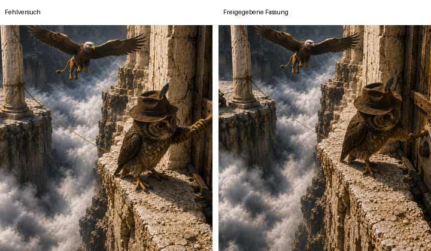
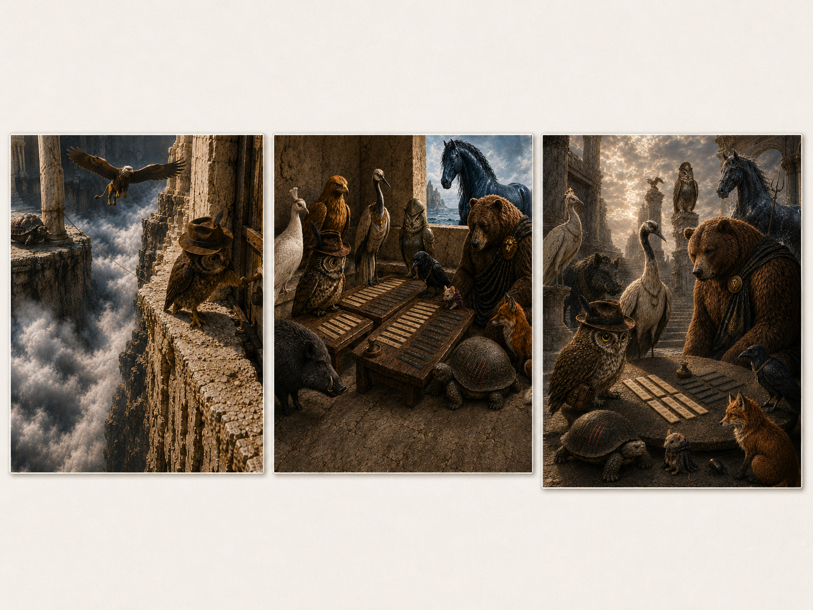

# Praxisbeispiel: Iterative Kinderbuch-Illustrationen für „Indiana Hood“ – Band 14

Dieses Beispiel zeigt einen realen Bildproduktions-Arbeitslauf mit den Bildarbeit-Regeln und mehreren Skills aus KI-Regeln. Es ist **kein Showcase, kein Benchmark und keine allgemeine Prompt-Vorlage für Kinderbuchillustrationen**.

Interessant ist nicht nur, dass am Ende eine zusammenhängende Bildserie entstand, sondern **wie Kapiteltext, Figurenreferenzen, menschliche Freigaben, Fehlversuche, Bildreviews und kontrollierte Neubauten zusammenspielten**.

## Kurzfassung

Der Arbeitslauf folgte grob diesem Muster:

```text
Kapiteltext + Projektkanon + Referenzbilder
→ Bildplanung / Pre-Brief
→ Generierung
→ menschliche Sichtung
→ Bildreview
→ Urteil + Änderungsstrategie
→ Human Gate
→ gezielte Revision oder Freigabe
→ erneutes Review
→ Serien-Kontinuitätscheck
→ Freigabe
```

Es war ausdrücklich kein Ablauf nach dem Muster `ein Prompt → fertiges Bild`.

## 1. Konkreter Auftrag

Für Band 14 der Kinderbuchreihe „Indiana Hood“ sollte eine zusammenhängende Illustrationsserie entstehen:

- 16 Innenillustrationen;
- 1 Cover;
- wiederkehrende Hauptfiguren mit stabiler visueller Identität;
- szenentreue Motive aus den jeweiligen Kapiteln;
- konsistente visuelle Welt trotz sehr unterschiedlicher Szenen;
- iterative Prüfung jedes Bildes vor der Freigabe.

Der Produktionsmaßstab war nicht nur: *Sieht das Bild attraktiv aus?*

Die zentrale Frage lautete:

> Erzählt das Bild den richtigen Moment mit den richtigen Figuren, Zuständen und Beziehungen – und bleibt es innerhalb der Serienkontinuität?

## 2. Lokale Projektwahrheit

Die konkrete Wahrheit für die Bilder kam nicht aus KI-Regeln, sondern aus dem Kinderbuchprojekt selbst.

Dazu gehörten insbesondere:

- die aktuellen Kapiteltexte von Band 14;
- etablierte Charakterreferenzen für Indiana Hood, Kora, Sokrates und weitere wiederkehrende Figuren;
- separate Referenzen für wiederkehrende mythologische Figuren;
- bereits freigegebene Bilder früherer Bände als visuelle Kontinuitätsanker;
- konkrete Zustände innerhalb der Handlung, etwa beschädigte Architektur, Ausrüstung oder sichtbare Markierungsmerkmale;
- menschliche Entscheidungen darüber, welcher Szenenmoment für einen Bildslot tatsächlich erzählt werden sollte.

Damit galt auch hier das zentrale Prinzip:

> Allgemeine Arbeitsweise zentral, konkrete Wahrheit lokal.

Eine attraktive Generierung durfte die lokale Story- oder Figurenwahrheit nicht überschreiben.

## 3. Relevante Skills

Im dokumentierten Arbeitslauf spielten insbesondere diese Skills eine Rolle:

| Skill | Beitrag im Beispiel |
|---|---|
| `bild-prebrief` | Szenenmoment, Bildaussage, sichtbare Entitäten, Kontinuität und Ausschlüsse vor der Generierung klären |
| `entitaetsbibel` | Pflichtmerkmale wiederkehrender Figuren und bekannte Fehlvarianten stabil halten |
| `bildreview` | Ergebnis gegen Aufgabe, Identität, Anatomie, Komposition und Kontinuität prüfen und genau einen nächsten Status wählen |
| `serien-kontinuitaetscheck` | Einzelbilder zusätzlich als gemeinsame Bildserie auf Identitäts-, Stil- und Zustandsdrift prüfen |

Zusätzlich waren die allgemeinen Bildarbeit-Regeln zu Quellenpriorität, Referenzsystemen, Szenenplanung, Kontinuität sowie Bildprüfung und Freigabe relevant.

Der iterative Teil des Arbeitslaufs ist eine konkrete Ausprägung des allgemeinen [Review-Revise-Loop](../../../Workflows/Review-Revise-Loop.md): Fachreview und Änderungsstrategie werden von der eigentlichen Revision getrennt; ein Review allein autorisiert noch keine Änderung.

## 4. Rollenverteilung Mensch / KI

### Mensch

Der Mensch:

- setzte Ziel, Umfang und Freigabegrenzen;
- stellte Kapiteltexte und Referenzbilder bereit;
- bestätigte oder korrigierte die lokale Projektwahrheit;
- prüfte jede Generierung visuell;
- brachte konkrete Findings ein, etwa falsche Figuren, menschliche Hände, falsche Größenrelationen oder einen falschen Szenenmoment;
- entschied nach dem Review, ob ein Bild freigegeben oder weiterbearbeitet wird;
- akzeptierte bewusst eine ältere Fassung, wenn eine neue Korrektur das Gesamtbild verschlechterte.

### KI-Assistent

Die KI:

- las Szenentext und Referenzen;
- entwickelte beziehungsweise konkretisierte die Bildidee;
- erzeugte die jeweilige Bildfassung;
- prüfte das Ergebnis anschließend kritisch gegen Auftrag und Kontinuität;
- unterschied zwischen Keeper, lokalem Feinschliff, kontrolliertem Feinschliff, kompositorischem Neubau und komplettem Neubau;
- formulierte den nächsten Eingriff möglichst eng;
- änderte bei wiederkehrenden Fehlern nicht nur den Promptwortlaut, sondern bei Bedarf die Aktionslogik oder Komposition der Szene.

Die Rollen waren damit nicht austauschbar. Insbesondere ersetzte ein KI-Review nicht das Human Gate.

## 5. Der praktische Review-Loop

Die Zusammenarbeit folgte bewusst einer kurzen, wiederholbaren Schleife:

```text
Bild erzeugen
→ Mensch sichtet das Ergebnis
→ „Dein Urteil?“
→ KI bewertet Aufgabe, Identität, Anatomie, Komposition und Kontinuität
→ genau einen nächsten Status und einen möglichst engen Eingriff empfehlen
→ Human Gate: freigeben, Änderung bestätigen oder neu ausrichten
→ gezielt korrigieren oder kontrolliert neu bauen
→ erneut prüfen
```

Die wiederkehrende Frage „Dein Urteil?“ war damit der **Review-Trigger**, nicht bereits die Änderungsfreigabe. Erst eine anschließende Entscheidung wie „machen wir so“ autorisierte die nächste Revision innerhalb des vereinbarten Scopes.

Typische Status im konkreten Arbeitslauf waren:

- **FINAL / behalten**;
- **ultra-lokaler Fix**;
- **enger Feinschliff**;
- **kontrollierter Feinschliff**;
- **kontrollierter kompositorischer Neubau**;
- **kompletter Neubau**.

Die Bezeichnungen waren eine gemeinsame Sprache für die beabsichtigte Eingriffstiefe. Sie waren **keine technische Garantie**, dass ein generatives Bildmodell tatsächlich nur den bezeichneten Bereich verändert.

## 6. Fehler und Korrekturen

Gerade die Fehler machen sichtbar, warum Review und Human Gates Teil des Prozesses waren.

### 6.1 Menschliche Hände bei einer Tierfigur

In einer Szene am offenen Kalkrand sollte Indiana Hood als kleine Eule einen Mechanismus bedienen. Mehrere lokale Korrekturversuche erzeugten weiterhin hand- oder fingerartige Greifformen.

**Problem:** Die konkrete Kontaktpose führte das Modell immer wieder zu menschlicher Handlogik, obwohl natürliche Vogelanatomie ausdrücklich verlangt war.

**Korrektur:** Der Fehler wurde nicht endlos mit demselben Mikro-Fix bekämpft. Die **Aktionslogik der Szene wurde geändert**, sodass der kritische Griffkontakt anders beziehungsweise weniger handähnlich dargestellt werden konnte.



Die linke Fassung ist gerade deshalb nützlich als Evidence, weil die Komposition grundsätzlich funktionierte, der Kontakt am Mechanismus aber anatomisch unbrauchbar blieb. Die rechte Fassung zeigt keinen „besseren Negativprompt“, sondern eine veränderte Lösung für dieselbe Szene.

**Lernpunkt:** Wenn derselbe Fehler trotz enger Korrekturen wiederkehrt, kann die Pose oder Szenenlogik selbst der Trigger sein. Dann ist ein kontrollierter Umbau oft sinnvoller als der fünfte nahezu identische Reparaturversuch.

### 6.2 Ein lokaler Fix beschädigt andere Bildbereiche

Bei einer bereits starken Szene sollte nur ein einzelnes Detail einer Nebenfigur korrigiert werden. Die neue Fassung verbesserte diesen Punkt, veränderte jedoch gleichzeitig andere Figuren, Kleidung und Komposition zum Schlechteren.

**Korrektur:** Die neue Version wurde verworfen. Eine ältere, insgesamt stärkere Fassung blieb Basis für einen engeren Eingriff.

**Lernpunkt:** „Neu“ ist nicht automatisch „besser“. Generative Bildbearbeitung garantiert keine echte Lokalität. Ein starker Keeper sollte nicht unnötig kaputtoptimiert werden.

### 6.3 Schönes Bild, falscher Bildslot

Mehrfach entstanden Bilder, die visuell stark waren, aber im Grunde noch einmal den vorherigen Szenenmoment erzählten.

Beispiele im Arbeitslauf:

- statt eines ruhigen Stempel-Moments erneut Gefahr und Außenkante;
- statt mehrerer begrenzter Erwiderungen erneut nur der einzelne Stempel als Hauptmotiv;
- statt Reparaturarbeit erneut eine Götterversammlung am Tisch.

**Korrektur:** Solche Fassungen wurden nicht kosmetisch repariert. Der Szenenmoment wurde neu definiert und die Komposition kontrolliert neu aufgebaut.

**Lernpunkt:** Szenentreue ist eine eigene Qualitätsachse. Ein spektakuläres Bild kann trotzdem ein Produktionsfehler sein.

### 6.4 Referenztreue bleibt probabilistisch

Wiederkehrende Figuren drifteten trotz Referenzen teilweise:

- Indiana wurde zeitweise als anderer Vogeltyp dargestellt;
- Sokrates wurde anthropomorph oder erhielt falsche Panzerdetails;
- Poseidon wechselte zwischen körperlichem Meerhengst und nahezu vollständig aus Wasser bestehender Erscheinung;
- Nebenfiguren erhielten Rüstungen, Kopfschmuck oder humanoide Gliedmaßen, die nicht zum Kanon gehörten.

**Korrektur:** Pflichtmerkmale und Ausschlüsse wurden erneut gegen Referenzen geprüft; bereits starke Bildbereiche wurden möglichst nicht erneut geöffnet.

**Lernpunkt:** Ein Referenzbild ist ein Anker, keine Garantie. Identitätsprüfung bleibt nach jeder Generierung erforderlich.

### 6.5 Ein Cover kann episch und trotzdem inhaltlich falsch sein

Ein früher Coverentwurf war visuell eindrucksvoll, machte jedoch ein Motiv aus dem Übergang zur nächsten Geschichte zu dominant.

**Korrektur:** Das Cover wurde kompositorisch neu gebaut. Die Hauptfiguren und die für Band 14 zentralen Verfahrensmotive erhielten die visuelle Priorität.

**Lernpunkt:** Auch Cover benötigen Slot-, Aussage- und Prioritätsprüfung. „Episch“ ersetzt keine korrekte erzählerische Gewichtung.

## 7. Was im Arbeitslauf gut funktionierte

### Klare lokale Sources of Truth

Kapiteltext und Referenzbilder gaben eine belastbare Grundlage, gegen die Generierungen geprüft werden konnten. Dadurch ließen sich auch attraktive Fehlbilder begründet ablehnen.

### Kurze Review-Schleifen und klare Human Gates

Die wiederkehrende Frage „Dein Urteil?“ löste eine kleine, wirksame Prüfschleife aus. Die KI musste das eigene Ergebnis nicht verteidigen, sondern erneut gegen die Produktionsaufgabe prüfen. Die Entscheidung über Freigabe oder den empfohlenen nächsten Eingriff blieb anschließend beim Menschen.

### Eingriffstiefe statt pauschaler Neugenerierung

Die Unterscheidung zwischen lokalem Fix, Feinschliff und Neubau half, starke Kompositionen nicht wegen kleiner Fehler vollständig aufzugeben.

### Strategiewechsel bei wiederkehrenden Fehlern

Besonders bei der Hand-/Greifproblematik war der wichtigste Fortschritt nicht ein immer längerer Ausschluss, sondern die Änderung der Szene, sodass der bekannte Schwachpunkt nicht mehr auf dieselbe Weise benötigt wurde.

### Serienblick statt Einzelbild-Faszination

Wiederkehrende Figurenmerkmale, Größenverhältnisse, Zustände und der visuelle Rhythmus zwischen ruhigen, gefährlichen und dialogorientierten Szenen wurden über den Einzelbild-Review hinaus betrachtet.

## 8. Grenzen und Schwächen

### Generative Korrektur ist nicht wirklich lokal

Auch ein „ultra-lokaler Fix“ kann andere Bildbereiche verändern. Die Bezeichnung beschreibt die **beabsichtigte Eingriffstiefe**, nicht eine technische Garantie des Modells.

### Anatomie und Kontakt bleiben fehleranfällig

Komplexe Kontakte, Greifen, Hände, Pfoten, Krallen und Flügel waren besonders anfällig für unplausible Mischformen. Negative Vorgaben allein verhinderten solche Fehler nicht zuverlässig.

### Viele Figuren erhöhen Drift

Je mehr wiederkehrende Figuren gleichzeitig in einer Szene vorkamen, desto wahrscheinlicher wurden Identitäts-, Ausrüstungs- und Proportionsabweichungen.

### Text im Bild ist keine belastbare Evidence

Beschriftungen auf Tafeln, Stempeln oder Schriftstreifen konnten sinngemäß wirken, waren aber nicht zuverlässig als korrekt gesetzter Buchtext zu behandeln.

### Same-Model-Review ist nützlich, aber nicht unabhängig

Die KI konnte ihr eigenes Bild kritisch nachprüfen und viele Fehler benennen. Das macht den Review jedoch nicht automatisch unabhängig. Menschliche Prüfung blieb ein echter zusätzlicher Kontrollkanal.

### Mehr Iterationen können Qualität verschlechtern

Ein weiterer Edit ist nicht automatisch ein Fortschritt. Gerade bei starken Keepern kann zusätzliche Generierung neue Fehler einführen. Deshalb gehört auch **bewusstes Stoppen** zur Bildproduktion.

## 9. Ergebnis

Im konkreten Arbeitslauf entstand eine vollständige Bildserie mit 16 Innenillustrationen und einem Cover. Die einzelnen Bilder unterscheiden sich stark in Szene und Komposition, werden aber über wiederkehrende Figuren, Referenzen, Stil und Zustandslogik als gemeinsame Produktion zusammengehalten.

Die folgende Collage zeigt eine kuratierte Auswahl freigegebener Motive aus dem Arbeitslauf. Sie veranschaulicht das sichtbare Ergebnis, ohne eine vollständige Produktionsdokumentation aller 17 finalen Motive oder sämtlicher Zwischenstände zu behaupten.



Für dieses Praxisbeispiel wird bewusst nur eine kleine kuratierte Evidence verwendet: ein Fehler-/Korrekturvergleich und die Ergebnis-Collage. Rohchatlogs und sämtliche Zwischenbilder sind zum Verständnis des Arbeitsprinzips nicht erforderlich.

Das Ergebnis ist projektspezifisch. KI-Regeln enthält daraus **keine allgemeine Regel**, wie eine Kinderbuchreihe auszusehen hat oder welche Figurengestaltung für andere Projekte geeignet ist.

## 10. Was das Beispiel zeigt

Das Beispiel zeigt:

- Bildarbeit mit generativer KI kann als kontrollierter Produktionsprozess statt als Prompt-Lotterie organisiert werden;
- projektlokale Referenzen und Storyquellen begrenzen generische Modellentscheidungen;
- Human Gates sind besonders wertvoll, wenn das Modell sein eigenes Ergebnis anschließend reviewt;
- ein guter Review muss zwischen attraktivem Bild und korrekter Produktionsaufgabe unterscheiden;
- wiederkehrende Fehler sollten zu Strategieänderungen führen und nicht nur zu immer längeren Negativprompts;
- eine ältere Fassung darf gewinnen;
- bewusstes Stoppen kann die bessere Qualitätsentscheidung sein;
- Serienkontinuität ist ein eigenes Problem neben der Qualität einzelner Bilder.

## 11. Was das Beispiel nicht beweist

Es beweist **nicht**:

- dass ein einzelner Prompt für ein druckfertiges Kinderbuchbild genügt;
- dass dieselben Referenzen in jedem Modell gleich zuverlässig funktionieren;
- dass Same-Model-Review einen unabhängigen Reviewer oder menschliche Freigabe ersetzt;
- dass die verwendeten Skills dadurch allgemein validiert oder benchmarked sind;
- dass jede Kinderbuchproduktion dieselbe Zahl an Iterationen benötigt;
- dass ein „lokaler Fix“ technisch garantiert lokal bleibt;
- dass generierte Schrift oder komplexe Anatomie ohne Prüfung zuverlässig korrekt sind.

## 12. Evidence und Veröffentlichungsgrenze

Das Vergleichsbild zeigt einen bewusst ausgewählten Fehlversuch und einen später freigegebenen Stand derselben Szene. Die Ergebnis-Collage zeigt zusätzlich eine kuratierte Auswahl freigegebener Motive. Beide dienen der technischen Einordnung des dokumentierten Arbeitsprinzips, nicht als Benchmark für Bildmodelle oder als vollständiger Nachweis aller Produktionsschritte.

Für weitere Projektartefakte gilt weiterhin:

- Veröffentlichbarkeit bewusst prüfen;
- keine unnötigen Rohchatlogs aufnehmen;
- nur Bilder verwenden, deren Veröffentlichung für das Praxisbeispiel gewollt ist;
- keine privaten Projektinformationen ergänzen, die für den Arbeitsprozess nicht notwendig sind;
- keine fehlende Evidence plausibel erfinden.

## 13. Technische Lesart

Der Kern dieses Beispiels lässt sich auf folgende Arbeitsweise reduzieren:

```text
Auftrag und Kapiteltext lesen
→ lokale Quellen und Referenzen bestimmen
→ passende Bildarbeit-Skills auswählen
→ Szenenmoment und Ausschlüsse festlegen
→ Bild generieren
→ Mensch sichtet das Ergebnis
→ kritisch reviewen
→ nächsten Status und Änderungsstrategie bestimmen
→ erforderliches Human Gate
→ lokal korrigieren, kontrolliert neu bauen oder freigeben
→ erneut reviewen
→ Keeper einfrieren
→ Bildfolge auf Serienkontinuität prüfen
→ Abschluss
```

Für andere Bildaufgaben kann der Ablauf deutlich kürzer, länger oder anders zusammengesetzt sein. Das Beispiel ist ein **Worked Example**, keine normative Pipeline.