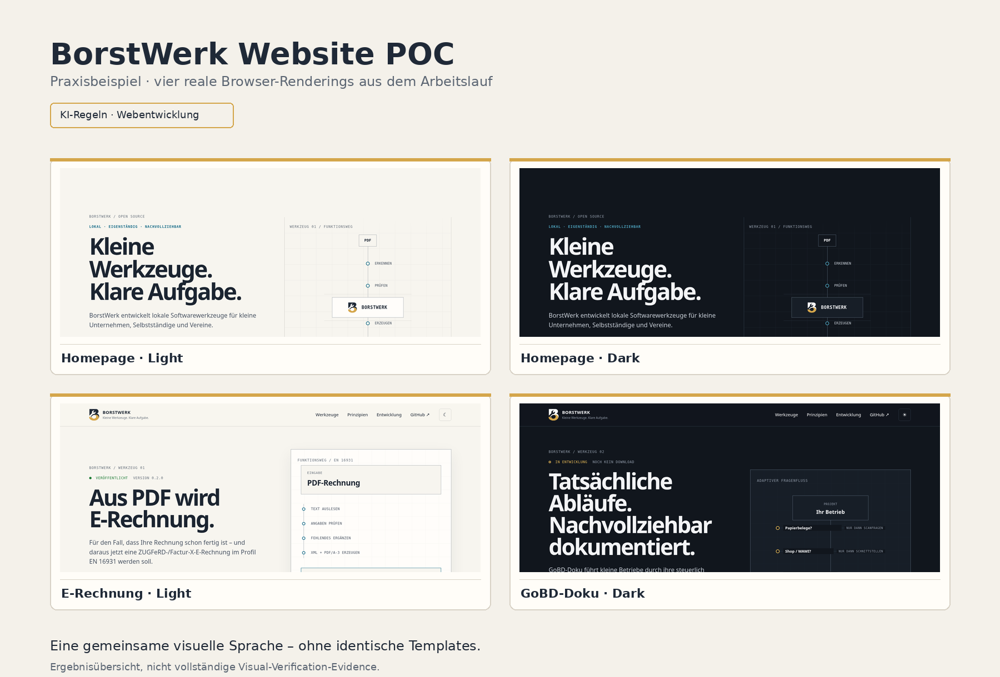

# Praxisbeispiel: BorstWerk-Website als Proof of Concept

Dieses Beispiel zeigt einen realen Webentwicklungs-Arbeitslauf mit mehreren KI-Regeln-Skills. Es ist **kein Showcase, kein Benchmark und keine allgemeine Webdesign-Vorlage**.

Interessant ist nicht, dass am Ende eine Website entstand, sondern **wie Projektkontext, Skills, menschliche Entscheidungen, Fehlversuche und Browser-Evidence zusammenspielten**.

## Kurzfassung

Der Arbeitslauf folgte grob diesem Muster:

```text
Projektkontext
→ Greybox
→ Designrichtung
→ Implementierung
→ Review
→ Browser-Evidence
→ Korrektur
→ erneute Verifikation
```

Es war ausdrücklich kein Ablauf nach dem Muster `ein Prompt → fertige Website`.

## 1. Konkreter Auftrag

Für BorstWerk sollte testweise eine Website als Proof of Concept entstehen. Der Versuch diente zugleich dazu, mehrere Webentwicklungs-Skills aus KI-Regeln in einer zusammenhängenden Aufgabe praktisch anzuwenden.

Das Ziel war nicht, eine generische Landingpage zu erzeugen. Die Seiten sollten sich aus den vorhandenen Projektinformationen ableiten und eine gemeinsame visuelle Sprache erhalten, ohne identische Templates zu werden.

## 2. Lokale Projektwahrheit

Die projektspezifische Wahrheit kam nicht aus KI-Regeln, sondern aus den jeweiligen BorstWerk-Projektquellen und menschlichen Entscheidungen.

Dazu gehörten unter anderem:

- vorhandene Produkt- und Projektinformationen;
- eine verbindliche Logo-Geometrie;
- die gewünschte technische Markenwirkung;
- die Entscheidung, Light und Dark Mode als bewusste Varianten zu betrachten;
- die Anforderung, fehlende Produktbilder oder andere Belege nicht plausibel zu erfinden.

Damit galt auch hier das zentrale Prinzip:

> Allgemeine Arbeitsweise zentral, konkrete Wahrheit lokal.

## 3. Relevante Skills

Im dokumentierten Arbeitslauf spielten insbesondere diese Skills eine Rolle:

| Skill | Beitrag im Beispiel |
|---|---|
| `web-content` | konkrete Produktwahrheit statt generischem Marketingfülltext |
| `frontend-design` | begründete Designrichtung und Anti-Generic-/Anti-Slop-Prüfung |
| `greybox` | Informationshierarchie und Seitenstruktur vor Dekoration |
| `design-system` | gemeinsame visuelle Sprache über mehrere Seiten |
| `motion-design` | Bewegung nur dort, wo sie Verbindung, Ablauf oder Zustand unterstützt |
| `motion-implementation` | technische Umsetzung freigegebener Motion |
| `web-design-review` | kritische Gegenprüfung der vorhandenen Gestaltung |
| `visual-verification` | Browserzustand und gerenderte Evidence statt Vertrauen in Quellcode allein |

Je nach Teilaufgabe konnten weitere Webregeln relevant sein. Das Beispiel behauptet nicht, dass diese Skill-Kombination für andere Websites verpflichtend ist.

## 4. Rollenverteilung Mensch / KI

### Mensch

Der Mensch:

- setzte Ziel und Projektgrenzen;
- stellte beziehungsweise bestätigte die lokale Projektwahrheit;
- wählte die Designrichtung;
- brachte Dark Mode als bewusste Variante ein;
- stellte kritische Fragen wie „wirkt das wie eine generische KI-Website?“;
- gab Human Gates für den nächsten Arbeitsschritt;
- entschied, welche Findings weiterverfolgt werden.

### KI-Assistent

Die KI:

- las die relevanten Regeln und Projektquellen;
- entwickelte Greybox und Designsystem;
- erzeugte beziehungsweise änderte HTML, CSS und JavaScript;
- führte Reviews gegen die vorhandene Umsetzung durch;
- prüfte gerenderte Browserzustände;
- meldete Findings und korrigierte bestätigte Probleme;
- übertrug die gemeinsame Designsprache auf weitere, fachlich unterschiedliche Seiten.

Die Rollen waren damit nicht austauschbar: Toolzugriff oder ein KI-Review ersetzten keine menschliche Projektentscheidung.

## 5. Verlauf und Gates

Der Arbeitslauf entwickelte sich iterativ:

| Stand | Auslöser | Folge |
|---|---|---|
| Brief | Projekt und relevante Skills lesen | „Werkzeug statt Plattform“ als technische Grundrichtung |
| v0.1 | erster Browserprototyp | Light/Dark und Konstruktionssprache konkretisiert |
| v0.2 | Anti-Generic-Review | Informationsstruktur stärker als Werkblatt statt Standard-Landingpage |
| v0.4 | Mobile-Review | Mobile nicht nur verkleinert, sondern als eigene Lesefassung behandelt |
| v0.5 | Motion-Gate | Progressive Enhancement und Reduced Motion berücksichtigt |
| v0.7 | E-Rechnung-Seite | erste informationsdichte Gegenprobe für das Designsystem |
| v0.8 | GoBD-Doku-Seite | zweite, fachlich andere Gegenprobe für dieselbe Designsprache |

Die Versionsbezeichnungen sind nur Marker dieses konkreten Arbeitslaufs und keine allgemeine KI-Regeln-Konvention.

## 6. Fehler und Korrekturen

Gerade die Fehler machen sichtbar, warum Review und Evidence Teil des Prozesses waren.

### 6.1 Erfundenes Logo im frühen Mockup

Ein früher Entwurf interpretierte das Logo frei. Die Projektquelle enthielt jedoch eine verbindliche, vermessene Geometrie.

**Korrektur:** Die freie Interpretation wurde verworfen und die lokale Source of Truth hatte Vorrang.

**Lernpunkt:** Allgemeine Designfreiheit darf keine projektspezifische Wahrheit überschreiben.

### 6.2 Zu generische Landingpage-Choreografie

Die erste Richtung ähnelte strukturell zu stark bekannten Landingpage-Mustern.

**Korrektur:** Ein kritischer Review änderte nicht nur Farben oder Oberflächen, sondern die Informationsarchitektur in Richtung Werkblatt, Werkzeugregister und Prüfstand.

**Lernpunkt:** Anti-Slop-Review ist nicht nur Kosmetik. Ein generisches Ergebnis kann eine strukturelle Korrektur benötigen.

### 6.3 Mobile Media Query überschreibt Einspaltenlayout

Der Quellcode wirkte plausibel, die gerenderte mobile Ansicht zeigte jedoch eine fehlerhafte Cascade.

**Korrektur:** Das Problem wurde anhand der Browseransicht eingegrenzt und das Layout korrigiert.

**Lernpunkt:** Code-Eindruck ist keine Render-Evidence.

### 6.4 Mobiles Menü trotz `hidden` sichtbar

Ein Interaktionszustand sah im Code korrekt aus, verhielt sich im Browser aber anders.

**Korrektur:** Der gerenderte Zustand wurde als maßgebliche Evidence verwendet.

**Lernpunkt:** Zustands- und Interaktionsfehler brauchen tatsächliche UI-Verifikation.

### 6.5 Dark-Mode-Kontrast auf der GoBD-Doku-Seite

Ein globaler Marken-Token war semantisch an einer Stelle falsch wiederverwendet worden. Dadurch brach der Kontrast im Dark Mode.

**Korrektur:** Der Browserrender machte den Fehler sichtbar; der Token-Einsatz wurde angepasst.

**Lernpunkt:** Ein Designsystem ist nicht dadurch korrekt, dass überall dieselben Tokens benutzt werden. Semantik und Kontext bleiben entscheidend.

### 6.6 Keine Fake-Screenshots

Für einen Teil des Projekts lagen noch keine veröffentlichten Produktbilder vor.

**Entscheidung:** Es wurden keine glaubwürdig aussehenden Screenshots erfunden, nur um die Seite vollständiger wirken zu lassen.

**Lernpunkt:** Fehlende Evidence bleibt fehlende Evidence.

## 7. Ergebnis

Im konkreten Proof of Concept entstanden drei zusammengehörige, aber nicht identische Seitentypen:

- **Homepage:** erklärt BorstWerk über eine technische Werkblatt-/Werkbank-Sprache;
- **E-Rechnung:** informationsdichtere Produktseite mit Werkzeug-/Prüfblatt-Charakter;
- **GoBD-Doku:** stärker dokumentationsorientierte Seite beziehungsweise Prüfstand.

Die gemeinsame visuelle Sprache wurde damit an fachlich unterschiedlichen Seiten gegengeprüft, statt nur auf einer einzelnen Landingpage zu funktionieren.



Die Abbildung ist eine kuratierte Ergebnisübersicht aus dem bereitgestellten POC-Stand v0.8. Sie zeigt bewusst nur ausgewählte Desktop-Zustände und ist keine vollständige Visual-Verification-Evidence aller getesteten Viewports und Interaktionszustände.

Dieses Ergebnis ist projektspezifisch. KI-Regeln enthält daraus **keine allgemeine Regel**, dass Websites wie Werkblätter aussehen sollten oder dass Light/Dark Mode immer erforderlich ist.

## 8. Was das Beispiel zeigt

Das Beispiel zeigt:

- mehrere begrenzte Skills können in einem zusammenhängenden Arbeitsprozess zusammenspielen;
- lokale Projektwahrheit kann und muss allgemeine Regeln begrenzen;
- menschliche Freigaben und kritische Fragen verändern den Arbeitsverlauf;
- Browser-Evidence kann Fehler finden, die im Quellcode nicht offensichtlich sind;
- ein Designsystem lässt sich durch Übertragung auf fachlich unterschiedliche Seiten gegenprüfen;
- Review ist nützlicher, wenn Findings tatsächlich zu erneuter Verifikation führen.

## 9. Was das Beispiel nicht beweist

Es beweist **nicht**:

- dass ein einzelner Prompt für eine gute Website genügt;
- dass dieselbe Gestaltung für andere Projekte geeignet ist;
- dass die beteiligten Skills dadurch produktionsreif oder unabhängig validiert sind;
- dass KI menschliche Freigaben ersetzen kann;
- dass ein Same-Model-Review einen unabhängigen Behavioral Eval oder Benchmark ersetzt;
- dass jeder Webauftrag dieselbe Skill-Reihenfolge benötigt.

## 10. Evidence und Veröffentlichungsgrenze

Die Ergebnisübersicht wurde aus dem für dieses Praxisbeispiel bereitgestellten Website-POC v0.8 gerendert. Sie dient der technischen Einordnung des dokumentierten Ergebnisses, nicht als Benchmark oder vollständiger Nachweis aller im Arbeitslauf genannten Prüfungen.

Für spätere Erweiterungen mit weiteren Screenshots oder anderen Projektartefakten gilt weiterhin:

- Veröffentlichbarkeit bewusst prüfen;
- private Projektinformationen entfernen;
- keine Rohchatlogs als notwendige Dokumentation behandeln;
- keine Produktstände, Belege oder Screenshots erfinden;
- nur Evidence aufnehmen, die zum Verständnis des Arbeitsprozesses tatsächlich beiträgt.

## 11. Technische Lesart

Der Kern dieses Beispiels lässt sich auf folgende Arbeitsweise reduzieren:

```text
Auftrag verstehen
→ lokale Sources of Truth lesen
→ passende Skills auswählen
→ Informationsstruktur entwerfen
→ Designrichtung konkretisieren
→ Human Gate
→ implementieren
→ kritisch reviewen
→ im Browser verifizieren
→ Finding beheben
→ erneut verifizieren
```

Für andere Aufgaben kann dieser Ablauf kürzer, länger oder anders zusammengesetzt sein. Das Beispiel ist ein **Worked Example**, keine normative Pipeline.

## Lizenzhinweis zu den Abbildungen

Die in diesem Praxisbeispiel eingebetteten Bilddateien sind abweichend von der Root-MIT-Lizenz unter **CC BY-SA 4.0** lizenziert, soweit daran lizenzierbare Rechte bestehen. Die Bildausgaben wurden vollständig durch OpenAI-Bildgenerierung erzeugt; Idee, Prompts, Gestaltungsvorgaben, Art Direction, Auswahl und Freigabe wurden menschlich gesteuert.

Die verbindliche Dateiliste, Attribution und Provenienz stehen in [`ASSET-LICENSES.md`](../../../ASSET-LICENSES.md). Die maschinenlesbare Zuordnung steht in [`REUSE.toml`](../../../REUSE.toml).

